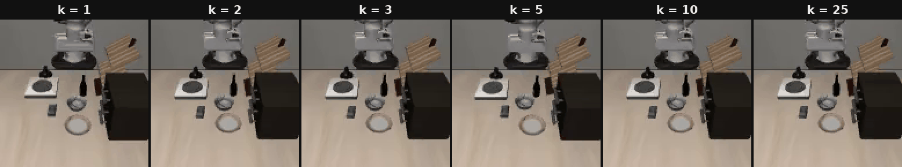

# T-bank Lab VLA исследование

<p align="center">
  
</p>
<p align="center"><sub>
Первый успешный роллаут на каждом бюджете демонстраций k — адаптация SmolVLA на LIBERO
(<a href="experiments/2026-08-23_18-20-07_pretrain_smolvla_bundle_all_k/">bundle-эксперимент</a>: full-FT + image-аугментации + state-шум, eval n=50).
</sub></p>

Репозиторий организован как журнал почти автономных экспериментов. Каждый
запуск хранит свою версию кода, конфигурации, команд запуска, результатов и
артефактов. Это позволяет вернуться к старому эксперименту без зависимости от
того, как изменился код следующего.

## Реестр

| Дата | Эксперимент | Краткое описание | Результат |
|---|---|---|---|
| 2026-08-17 | [`smolvla_pretrain_libero`](experiments/2026-08-17_smolvla_pretrain_libero/) | Претрен SmolVLA на libero_90 + seen-контроль | [отчёт](experiments/2026-08-17_smolvla_pretrain_libero/reports/REPORT.md) |
| 2026-08-18 | [`pretrain_smolvla_prompt_only_2`](experiments/2026-08-18_pretrain_smolvla_prompt_only_2/) | Zero-shot (k=0): только промпт, без дообучения | [отчёт](experiments/2026-08-18_pretrain_smolvla_prompt_only_2/reports/REPORT.md) |
| 2026-08-18 | [`pretrain_smolvla_naive_baseline_few_shot_tune`](experiments/2026-08-18_pretrain_smolvla_naive_baseline_few_shot_tune/) | Наивный бейзлайн файнтюна при k=5/10/25 | [отчёт](experiments/2026-08-18_pretrain_smolvla_naive_baseline_few_shot_tune/reports/REPORT.md) |
| 2026-08-18 | [`pretrain_smolvla_few_shot_tune_low_k`](experiments/2026-08-18_pretrain_smolvla_few_shot_tune_low_k/) | Кривая при малых бюджетах k=1/2/3 | [отчёт](experiments/2026-08-18_pretrain_smolvla_few_shot_tune_low_k/reports/REPORT.md) |
| 2026-08-18 | [`analyst_curve_baseline`](experiments/2026-08-18_analyst_curve_baseline/) | Сводная cost curve k=0..25 и nAUC | [отчёт](experiments/2026-08-18_analyst_curve_baseline/reports/REPORT.md) |
| 2026-08-19 | [`seen_scene_goal_prompts_v2`](experiments/2026-08-19_seen_scene_goal_prompts_v2/) | Instruction following: goal-промпты в seen-сцене | [вердикт](experiments/2026-08-19_seen_scene_goal_prompts_v2/reports/FINDINGS.md) |
| 2026-08-19 | [`pretrain_smolvla_prompt_only_3`](experiments/2026-08-19_pretrain_smolvla_prompt_only_3/) | Воспроизводимый k=0 с языковыми контролями | [отчёт](experiments/2026-08-19_pretrain_smolvla_prompt_only_3/reports/REPORT.md) |
| 2026-08-19 | [`goal_scene_seen_prompts`](experiments/2026-08-19_goal_scene_seen_prompts/) | Спасают ли обученные строки zero-shot в goal-сцене | [вердикт](experiments/2026-08-19_goal_scene_seen_prompts/reports/FINDINGS.md), [harness-note](experiments/2026-08-19_goal_scene_seen_prompts/reports/HARNESS_NOTE.md) |
| 2026-08-19 | [`base_smolvla_cost_curve`](experiments/2026-08-19_base_smolvla_cost_curve/) | Ценность претрена: кривая с голого smolvla_base | [вердикт](experiments/2026-08-19_base_smolvla_cost_curve/reports/FINDINGS.md) |
| 2026-08-20 01:55:23 | [`goal_prompts_in_seen_hosts`](experiments/2026-08-20_01-55-23_goal_prompts_in_seen_hosts/) | Goal-промпты в чужих seen-сценах | [вердикт](experiments/2026-08-20_01-55-23_goal_prompts_in_seen_hosts/reports/FINDINGS.md) |
| 2026-08-20 01:55:23 | [`seen_semantic_paraphrases`](experiments/2026-08-20_01-55-23_seen_semantic_paraphrases/) | Хрупкость к парафразам инструкции | [вердикт](experiments/2026-08-20_01-55-23_seen_semantic_paraphrases/reports/FINDINGS.md) |
| 2026-08-20 01:55:23 | [`seen_article_drop`](experiments/2026-08-20_01-55-23_seen_article_drop/) | Хрупкость к удалению артиклей | [вердикт](experiments/2026-08-20_01-55-23_seen_article_drop/reports/FINDINGS.md) |
| 2026-08-20 01:55:23 | [`seen_prompts_in_goal_scene`](experiments/2026-08-20_01-55-23_seen_prompts_in_goal_scene/) | Перенос seen-навыков в goal-сцену | [вердикт](experiments/2026-08-20_01-55-23_seen_prompts_in_goal_scene/reports/FINDINGS.md) |
| 2026-08-20 20:03:21 | [`pretrain_smolvla_low_k_action_steps`](experiments/2026-08-20_20-03-21_pretrain_smolvla_low_k_action_steps/) | Влияние n_action_steps при малых k | [отчёт](experiments/2026-08-20_20-03-21_pretrain_smolvla_low_k_action_steps/reports/REPORT.md) |
| 2026-08-21 20:37:56 | [`pretrain_smolvla_naive_deterministic_repro`](experiments/2026-08-21_20-37-56_pretrain_smolvla_naive_deterministic_repro/) | Детерминированное воспроизведение k=5/10/25 | [отчёт](experiments/2026-08-21_20-37-56_pretrain_smolvla_naive_deterministic_repro/reports/REPORT.md) |
| 2026-08-21 20:37:56 | [`pretrain_smolvla_low_k_deterministic_repro`](experiments/2026-08-21_20-37-56_pretrain_smolvla_low_k_deterministic_repro/) | Детерминированное воспроизведение k=1/2/3 | [отчёт](experiments/2026-08-21_20-37-56_pretrain_smolvla_low_k_deterministic_repro/reports/REPORT.md) |
| 2026-08-22 18:10:40 | [`pretrain_smolvla_full_ft_low_k`](experiments/2026-08-22_18-10-40_pretrain_smolvla_full_ft_low_k/) | Полный файнтюнинг против expert-only при малых k | [отчёт](experiments/2026-08-22_18-10-40_pretrain_smolvla_full_ft_low_k/reports/REPORT.md) |
| 2026-08-22 22:43:55 | [`pretrain_smolvla_state_noise_k1`](experiments/2026-08-22_22-43-55_pretrain_smolvla_state_noise_k1/) | State-шум как регуляризация при k=1 | [отчёт](experiments/2026-08-22_22-43-55_pretrain_smolvla_state_noise_k1/reports/REPORT.md) |
| 2026-08-23 00:18:49 | [`pretrain_smolvla_image_aug_low_k`](experiments/2026-08-23_00-18-49_pretrain_smolvla_image_aug_low_k/) | Image-аугментации и меньше шагов при малых k | [отчёт](experiments/2026-08-23_00-18-49_pretrain_smolvla_image_aug_low_k/reports/REPORT.md) |
| 2026-08-23 14:31:07 | [`pretrain_smolvla_state_noise_k1_1k_steps`](experiments/2026-08-23_14-31-07_pretrain_smolvla_state_noise_k1_1k_steps/) | Доза state-шума при вдвое меньших шагах | [отчёт](experiments/2026-08-23_14-31-07_pretrain_smolvla_state_noise_k1_1k_steps/reports/REPORT.md) |
| 2026-08-23 18:20:07 | [`pretrain_smolvla_bundle_all_k`](experiments/2026-08-23_18-20-07_pretrain_smolvla_bundle_all_k/) | Бандл лучших приёмов на всей кривой k=1..25 | [отчёт](experiments/2026-08-23_18-20-07_pretrain_smolvla_bundle_all_k/reports/REPORT.md) |
| 2026-08-23 20:49:13 | [`bonus_qwen35_progress_critic`](experiments/2026-08-23_20-49-13_bonus_qwen35_progress_critic/) | Бонус: обучение progress-критика Qwen3.5-4B | [report](experiments/2026-08-23_20-49-13_bonus_qwen35_progress_critic/reports/TRAINING.md) |
| 2026-08-23 23:03:30 | [`bonus_critic_vs_robometer_ranking`](experiments/2026-08-23_23-03-30_bonus_critic_vs_robometer_ranking/) | Бонус: свой критик против Robometer в ранжировании роллаутов | [отчёт](experiments/2026-08-23_23-03-30_bonus_critic_vs_robometer_ranking/reports/REPORT.md) |

## Единое uv-окружение

Корневой `pyproject.toml` объединяет экспериментальные пакеты в uv-workspace,
а `uv.lock` фиксирует одно согласованное окружение Python 3.12 для всего
репозитория. Корневой проект виртуальный: в нём нет общего изменяемого кода, он
только собирает зависимости автономных экспериментов.
Workspace ограничен Linux x86_64, поскольку текущий робототехнический стек
фиксирует проверенные PyTorch 2.7.1 и CUDA 12.6 для GPU-запусков.

Пошаговая инструкция для внешнего пользователя — установка с нуля и оценка
готового чекпойнта на любой LIBERO-suite (включая `libero_10`) — в
[REPRODUCING.md](REPRODUCING.md).

```bash
# Создать или актуализировать .venv строго по lock-файлу.
uv sync --frozen

# Запустить все тесты из общего окружения.
uv run --frozen pytest

# Выполнить команду внутри конкретного эксперимента.
uv run --frozen \
  --directory experiments/2026-08-18_pretrain_smolvla_prompt_only_2 \
  pretrain-prompt-2-aggregate
```

При добавлении нового каталога `experiments/YYYY-MM-DD_HH-MM-SS_name` его `pyproject.toml`
автоматически попадает в workspace через `experiments/*`. Чтобы пакет также
устанавливался обычным `uv sync`, его имя нужно добавить в корневые
`project.dependencies` и `tool.uv.sources` с `workspace = true`.

## Общий Trackio dashboard

Каждый эксперимент хранит собственную Trackio-базу и media внутри своего
`artifacts/trackio/`. Корневой launcher создаёт согласованный снимок баз,
индексирует media через hard links и открывает один dashboard со всеми проектами:

```bash
scripts/show_trackio.sh
```

Проекты переключаются в sidebar Trackio. Индекс в `.trackio-dashboard/`
генерируется при запуске и не дублирует исходные media-файлы. Hard links нужны,
потому что Trackio намеренно не отдаёт media, если симлинк разрешается за
пределами dashboard-каталога. Старые GIF, записанные как `trackio.Video`,
автоматически получают совместимую MP4-копию только в dashboard-cache;
experiment-local база не меняется. Добавленный новый эксперимент появится после
того, как он создаст свою `artifacts/trackio/*.db`. Посмотреть найденные проекты
без запуска UI можно командой `scripts/index_trackio.sh`.

## Официальные LIBERO-датасеты

Стабильный корневой загрузчик скачивает исходные HDF5 из официального
`yifengzhu-hf/LIBERO-datasets` на закреплённой ревизии
`f13aa24a3da8c43c7225569f28c562979fa0e35a`. Частичные загрузки продолжаются,
а готовые файлы сверяются с LFS SHA-256 из Hub-манифеста.

```bash
# Только 10 целевых задач (~5.9 GiB).
scripts/download_official_libero_goal.sh

# Только 90 seen-задач (~62.1 GiB).
scripts/download_official_libero_90.sh

# Обе suite; libero_goal скачивается первой.
scripts/download_official_libero.sh --suite all
```

По умолчанию данные и машинно-читаемые manifest/status/verification лежат в
`/var/tmp/libero_official_f13aa24`. Другой каталог задаётся через
`--root /absolute/path`; `--max-workers` управляет параллелизмом.

## Контракт структуры

```text
experiments/
└── YYYY-MM-DD_HH-MM-SS_short_name/
    ├── README.md          # постановка, протокол и точные команды
    ├── pyproject.toml     # зафиксированное окружение Python
    ├── configs/           # конфигурации только этого эксперимента
    ├── scripts/           # entrypoints только этого эксперимента
    ├── src/               # снимок экспериментального кода
    ├── tests/             # проверки этого снимка
    ├── results/
    │   ├── raw/           # сырые rollout/metrics
    │   ├── summary/       # таблицы и графики
    │   ├── media/         # GIF и другие компактные результаты
    │   └── logs/          # runtime-логи
    ├── artifacts/         # веса, manifest, schema и служебные данные
    └── reports/           # предсказания, отклонения и выводы
```

# Как запустить репозиторий: оценка чекпойнтов и воспроизведение экспериментов на LIBERO

## 1. Требования

- Linux x86_64, NVIDIA GPU (CUDA 12.6 драйвер), ~30 ГБ диска.
- Python 3.12 и [uv](https://docs.astral.sh/uv/). Больше ничего ставить
  руками не нужно: все версии (lerobot 0.6.1 c LIBERO-интеграцией,
  PyTorch 2.7.1+cu126, MuJoCo и т.д.) зафиксированы в `uv.lock`.

## 2. Установка окружения

```bash
git clone <repo> vla_test && cd vla_test
uv sync --frozen          # создаёт .venv строго по lock-файлу
source .venv/bin/activate
export MUJOCO_GL=egl      # headless-рендеринг (без дисплея)
```

## 3. Первый запуск LIBERO: конфиг без интерактива

При первом импорте `libero` пакет интерактивно спрашивает пути и в
headless/detached-режиме падает с `EOFError`. Сгенерируйте конфиг заранее:

```bash
export LIBERO_CONFIG_PATH=$PWD/.libero_config
python - <<'EOF'
import importlib.util, os, yaml
from pathlib import Path
root = Path(next(iter(importlib.util.find_spec("libero").submodule_search_locations)))
bench = root / "libero"
cfg = {"benchmark_root": str(bench), "bddl_files": str(bench / "bddl_files"),
       "init_states": str(bench / "init_files"), "datasets": str(root / "datasets"),
       "assets": str(bench / "assets")}
out = Path(os.environ["LIBERO_CONFIG_PATH"]); out.mkdir(parents=True, exist_ok=True)
(out / "config.yaml").write_text(yaml.safe_dump(cfg, sort_keys=False))
print("written", out / "config.yaml")
EOF
```

Сцены/объекты (assets) lerobot скачает с Hugging Face при первом создании
среды (`lerobot/libero-assets`).

## 4. Чекпойнты

Инструкция применима к любому SmolVLA-чекпойнту в формате lerobot — папке
`pretrained_model/` (config, веса, процессоры с нормализационной
статистикой): базовому претрену, любой адаптации из
`experiments/*/artifacts/adapted_checkpoints/` (там же манифесты с путями и
SHA-256), чекпойнту из приложенного к отчёту пакета или вашему собственному,
дообученному этим же кодом. Если есть манифест — сверьте веса:

```bash
sha256sum <ckpt>/pretrained_model/model.safetensors   # должен совпасть с *.json манифестом
```

Важно про схему наблюдений: все чекпойнты этого репозитория обучены на двух
камерах 128×128 с ключами `top` (внешняя) и `wrist_image` (запястье). В
средах LIBERO камеры называются `agentview_image` /
`robot0_eye_in_hand_image`, поэтому при оценке нужен маппинг имён и размер
128 (команды ниже уже содержат это). Конвенция гриппера и ориентация кадров
согласованы со средой ещё на этапе подготовки данных — никаких
дополнительных преобразований не требуется. Для чекпойнта с другой схемой
камер поправьте маппинг/размеры под его `config.json`.

## 5. Быстрая проверка чекпойнта на любой suite (пример: libero_10)

Штатный `lerobot-eval` работает с любой папкой `pretrained_model`:

```bash
lerobot-eval \
  --policy.path=/path/to/pretrained_model \
  --env.type=libero \
  --env.task=libero_10 \
  --env.task_ids='[0]' \
  --env.observation_height=128 \
  --env.observation_width=128 \
  --env.camera_name_mapping='{"agentview_image":"top","robot0_eye_in_hand_image":"wrist_image"}' \
  --env.episode_length=520 \
  --eval.n_episodes=20 \
  --eval.batch_size=1 \
  --seed=1000 \
  --output_dir=eval_out/libero10_task0
```

- `--env.task` — любая из `libero_10`, `libero_goal`, `libero_spatial`, `libero_object`,
  `libero_90` (для goal-задач мы использовали `--env.episode_length=300`).
- `--env.task_ids` — номера задач внутри suite.

- Инференс-ручка `--policy.n_action_steps=25|35|50` (обучено с 50) задаёт,
  сколько действий из 50-шагового чанка исполнять до перепланирования.

Что ожидать: адаптированные чекпойнты (`bundle/task_T/k_K`) специализированы
под свою задачу `libero_goal`; на чужих suite (в т.ч. `libero_10`) и у них,
и у base-претрена zero-shot успех около нуля — это известное свойство
(см. prompt-only эксперименты в `README.md`). Осмысленные проверки:
бандл-чекпойнт на своей задаче (номера успехов — в `REPORT.md`
эксперимента `2026-08-23_18-20-07_pretrain_smolvla_bundle_all_k`) или
base-претрен на seen-задаче `libero_90` (позитивный контроль 20/20 на
task 0).

## 6. Точное воспроизведение нашего протокола оценки (libero_goal, задачи 0–2)

Наш протокол строже, чем дефолтный `lerobot-eval`: batch=1, пер-эпизодные
сиды среды и шума политики (`1000 + номер эпизода`), пиновка
`init_state_id = номер эпизода`, все видео на диск. Он реализован внутри
каждого эксперимента одинаково — схема универсальная:

```bash
cd experiments/<любой_эксперимент>
source scripts/common_env.sh       # выставляет пути, LIBERO_CONFIG_PATH и т.д.
scripts/prepare.sh                 # одноразовый preflight (манифесты, конфиг LIBERO)
scripts/eval_one.sh <аргументы>    # оценка одной точки
```

Аргументы `eval_one.sh` зависят от осей эксперимента (см. его README):
например, у бандла это `task_id budget n_action_steps`
(`scripts/eval_one.sh 0 3 50`), у state-noise — `task_id alpha
n_action_steps`. Результат: JSON с поэпизодными исходами в
`results/raw/...` и видео каждого эпизода рядом. Ожидается, что чекпойнт
лежит по пути из `artifacts/adapted_checkpoints/...json` (поправьте симлинк
`artifacts/checkpoints`, если веса развёрнуты в другом месте).

## 7. Полный запуск эксперимента (обучение + оценка) и свои эксперименты

Для обучения нужны данные: официальные HDF5 качаются
`scripts/download_official_libero.sh`, затем
конвертируются в LeRobot-формат экспериментом
`2026-08-17_smolvla_pretrain_libero` (см. его README; там же проверка
round-trip и конвенции гриппера).

Дальше любой эксперимент воспроизводится с нуля детерминированно (сид 1000)
одной и той же последовательностью из его README:

```bash
cd experiments/<эксперимент>
source scripts/common_env.sh && pytest -q   # тесты протокола
scripts/prepare.sh                          # preflight-артефакты
scripts/audit.sh                            # аудит обучаемых параметров
scripts/smoke_dataset.sh && scripts/smoke_env.sh
scripts/production_smoke.sh <gpu>           # determinism gate
scripts/run_all.sh                          # fan-out: тренировки + оценки + отчёт
scripts/status.sh                           # прогресс в любой момент
```

Свой эксперимент делается копией ближайшего по смыслу каталога
`experiments/YYYY-MM-DD_HH-MM-SS_имя` (правила — в корневом `README.md`:
новый timestamped-каталог, код копируется, а не импортируется, пакет
регистрируется в корневом `pyproject.toml` + `uv lock`).

