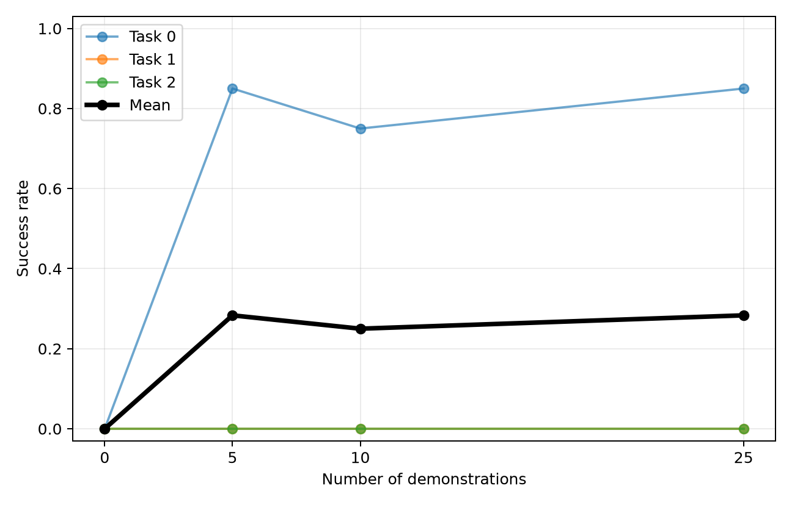

# Задача 1 — seen-претрен, zero-shot и baseline cost curve

## Краткий ответ

В качестве seen-модели взят публичный `crislmfroes/smolvla-libero-90`
на неизменяемой ревизии `418f9d0e...`. Это SmolVLA, дообученная из
`lerobot/smolvla_base` 30 тысяч шагов на 4 500 эпизодах LIBERO-90. Такой путь
прямо разрешён условием и, в отличие от `HuggingFaceVLA/smolvla_libero`, не
использует целевой `libero_goal`. Вычислительный бюджет поэтому направлен на
девять одинаково поставленных адаптаций и 20 rollout-эпизодов на точку.

## Данные и честность сплита

Цели — suite-local task IDs 0–2 `libero_goal`:

| ID | Инструкция | Глобальный `task_index` |
|---:|---|---:|
| 0 | `open the middle drawer of the cabinet` | 19 |
| 1 | `put the wine bottle on the rack` | 11 |
| 2 | `open the top drawer and put the bowl inside` | 12 |

Эпизоды выбирались по точному тексту инструкции, а не по глобальному
`task_index`: первые 5/10/25 совпадений в порядке датасета, без просмотра
траекторий и отбора удачных. Полный список закреплён в
`artifacts/episode_manifest.json`. Число train-кадров:

| Task | k=5 | k=10 | k=25 |
|---:|---:|---:|---:|
| 0 | 682 | 1 359 | 3 463 |
| 1 | 836 | 1 706 | 4 307 |
| 2 | 1 052 | 2 121 | 4 926 |

Текущая head-ревизия датасета оказалась внутренне неконсистентной; взята
последняя предшествующая ревизия `9176d427...`. В ней также исправлены только
локальные metadata-указатели для выбранных эпизодов, с сохранением исходника и
построчным аудитом. Эти отклонения были зафиксированы до затронутых запусков в
`reports/DEVIATIONS.md`; изображения, состояния и действия не менялись.

## Протокол

- Zero-shot: 20 эпизодов на задачу, seed 1000, правильная инструкция.
- Языковые контроли на тех же reset seeds: циклически чужая инструкция и
  фиксированный nonsense prompt `perform the dax florp twice`.
- Для каждой пары `(task, k)` — отдельный старт с одного seen-чекпойнта,
  2 000 optimizer steps, batch 32, полный fine-tuning 393M из 450M параметров.
- Без аугментаций, replay, PEFT, target-aware checkpoint selection и
  промежуточного rollout-подбора; оценивается только финальный checkpoint.
- На каждой адаптированной точке — 20 эпизодов с seed 1000.

Численные предсказания и объяснение формы кривой зафиксированы до первого
rollout в commit `f307cf7` и файле `reports/PREDICTIONS.md`.

## Результаты

В ячейках указано число успехов из 20 и success rate; интервалы ниже — Wilson
95% CI. Все три языковых условия k=0 дали одинаковые 0/20 на каждой задаче.

| Task | k=0 true | k=0 wrong | k=0 nonsense | k=5 | k=10 | k=25 |
|---:|---:|---:|---:|---:|---:|---:|
| 0 | 0/20 (0.00) | 0/20 (0.00) | 0/20 (0.00) | 17/20 (0.85) | 15/20 (0.75) | 17/20 (0.85) |
| 1 | 0/20 (0.00) | 0/20 (0.00) | 0/20 (0.00) | 0/20 (0.00) | 0/20 (0.00) | 0/20 (0.00) |
| 2 | 0/20 (0.00) | 0/20 (0.00) | 0/20 (0.00) | 0/20 (0.00) | 0/20 (0.00) | 0/20 (0.00) |
| **Pooled / mean** | **0/60 (0.000)** | **0/60 (0.000)** | **0/60 (0.000)** | **17/60 (0.283)** | **15/60 (0.250)** | **17/60 (0.283)** |

95% CI: 17/20 — `[0.640, 0.948]`, 15/20 — `[0.531, 0.888]`,
0/20 — `[0.000, 0.161]`. Для pooled-точек: 17/60 —
`[0.185, 0.408]`, 15/60 — `[0.158, 0.372]`, 0/60 —
`[0.000, 0.060]`.

Итоговая macro/pooled cost curve совпадает здесь, потому что на задачу было
одинаковое число эпизодов: **0.000 → 0.283 → 0.250 → 0.283**. Главное, что
средняя скрывает два разных режима: task 0 почти насыщается уже на пяти демо,
а tasks 1/2 не дают ни одного успеха даже на 25.

Финальные train-loss по `(k=5,10,25)` равны task 0:
`(0.026, 0.040, 0.068)`, task 1: `(0.039, 0.052, 0.081)`, task 2:
`(0.035, 0.051, 0.074)`. Таким образом, очень хороший supervised fit не
ранжирует closed-loop success: task 0/k=5 и task 1/k=5 имеют близкие loss, но
0.85 против 0.00 success.

### Языковой контроль

True, wrong и nonsense prompt дали по 0/60. Это **floor effect**, а не
доказательство игнорирования языка: когда seen-политика не решает ни одного
target-эпизода с правильным prompt, отсутствие дальнейшего падения при подмене
текста неидентифицируемо. Поэтому честный вывод ограничен: по этим rollout'ам
нельзя подтвердить ни языковую чувствительность, ни её отсутствие. Следующий
информативный контроль для Задачи 2 — подмена инструкции у уже успешной
task-0-adapted политики или оценка action divergence на одинаковых кадрах.

### Форма кривой и разбор предсказаний

Прогнозировалась монотонная сублинейная mean-кривая
`0.10 → 0.28 → 0.48 → 0.70`; получено
`0.00 → 0.283 → 0.250 → 0.283`. Число k=5 случайно совпало почти идеально,
но механизм был предсказан неверно: вместо умеренных task rates
`0.35/0.30/0.20` получились экстремальные `0.85/0/0`.

- Task 0 опровергла гипотезу о слабом k=5: кривая
  `0 → 0.85 → 0.75 → 0.85`. На парных seed'ах k=5 и k=25 имеют 16 общих
  успехов, по одному уникальному успеху и два общих провала. Провал k=10 мал
  относительно биномиальной неопределённости, но реален в сырых исходах: он
  теряет три k=5 success-seed и приобретает один новый.
- Tasks 1/2 опровергли предполагаемый рост вплоть до k=25:
  обе кривые `0 → 0 → 0 → 0`. Значит, добавление демонстраций без изменения
  метода адаптации здесь не возвращает генерализацию дешевле всего.
- Рабочая гипотеза: task 0 — короткий drawer-opening навык, близкий к
  seen-манипуляциям; task 1 требует точного размещения бутылки на rack, а task 2
  — составного drawer+bowl поведения. Это inference, а не доказанный причинный
  механизм; его следует проверять progress/reward-моделью и покомпонентными
  subgoal-метриками.

Post-hoc просмотр одного k=25 failure-video каждой из tasks 1/2 показывает
целенаправленное, а не неподвижное поведение: политика переносит бутылку к rack,
а в task 2 открывает drawer и перемещает bowl к/в него, но точный бинарный
predicate не срабатывает. Это только качественная диагностика двух эпизодов,
однако она мотивирует исходную вторую цель проекта: video-progress оценка может
различать почти выполненные subgoals там, где sparse success остаётся нулём.

## Воспроизводимость

Конфигурация находится в `configs/protocol.yaml`, точные команды — в
`scripts/`, сырые rollout JSON — в `results/raw/`, логи — в `results/logs/`,
а агрегированные JSON/CSV/PNG — в `results/summary/`. Веса и остальные
experiment-owned артефакты находятся в `artifacts/`. Проверка кода: `pytest -q`
(4 теста), `compileall` и
`git diff --check`.
