# Отчет

Этот отчет писал я сам (даже не прогонял на предмет грамматических ошибок), поэтому, извините, не выдержал академический стиль, скорее выгдядит как рассказ, но надеюсь будет все понятно.

## Кратко как устроена репа с экспериментами, чтобы было понятно что происходит

Как вы могли догадаться, что я тот еще вайбкодер и я придумал для своих репозиториев следующую структуру (которой я вдохновился когда работал в яндексе): у меня есть отдельная папка с экспериментами (`experiments/`), каждый эксперимент это отденльный самодостаточный маленький проект в котором прописаны свои зависимости, readme.md и тд. Но у каждого жкспа есть своя одинаковая структура (подробнее написано в разделе Контракт структуры [тут](README.md)) которая содержит папки:

- конфигов
- скриптов: понятно основа
- bash скриптами: чтобы запускать отдельные модули
- резльтатами метрик: всякие гифки с результатами, таблички
- маленькие описания и результаты эксперимента: скорее для код агента, но для человека который сам писал этот проект тоже будет понятно

Так я решаю 2 проблемы: воспроизводимости, изменений кода и организации результатов экспериметов. Воспроизводимость тут довольно понятная, можно просто зайти в папку и запустить трейнинг или валидацию скрпитом. А изменения кода это когда, например, мы обучали модель одним методом, потом решили что-то поменять и надо будет менять какой-нибудь training.py который мы можем поломать.

Минусы тоже есть, что можно потерять согласовность файлов. Например, скрипты для валидации результатов могут разойтись, но я для этого придумал отдельный скилл в calude code который это проверяет (может это костыль конечно).

Также есть в корне папка `scripts/` в ней находятся файлы которые нужны для всех экспериментов (в данном случае это скачивание датасета и запуск trackio).

## Теперь моя долгая история с поиском и настройкой правильного Lebero датасета

С данными я разбирался долго, поскольку с датасетом возникла путаница (я делал жо того как увидел правки в задании и я не сразу заметил). В начале я скачал `[HuggingFaceVLA/libero](https://huggingface.co/datasets/HuggingFaceVLA/libero)`, но там оказлось что там только 40 задач и отсутствовал полный libero_90, поэтому он не подходил для честного предобучения на seen-задачах. 

Я пошел искать где настоящий датасет и нашел разумеется на оф сайте (с него есть ссылка на hf yifengzhu-hf/LIBERO-datasets), но там датасет хранится в картинках а не видео и он оказался гигантским. Я решил поискать уже ужатые датасеты чтобы качать было меньше и я нашел дургой датасет [crislmfroes/smolvla-libero-90](https://huggingface.co/crislmfroes/smolvla-libero-90), но с ним оказалось еще больше проблем: этот чувак неправилньо повернул картинки и отзеркалил их, был ошибочный fps, часть демонстраций все равно отсутсвовала и тд. 

Поэтому делать нечего, я скачал полный датасет и перевел их в формат LeRobot: сохранил разрешение 128x128, выставил правильные 20 FPS, согласовал ориентацию изображений и гриппера со средой. В результате получил полный датасет 4500 демонстраций для libero_90 и 500 для libero_goal.

## Как я дизайню эксперименты (трейн и валидация)

Каждая точка cost curve обучалась независимо: для пары задача и $k$ я каждый раз начинал с одного и того же претрейна и брал первые $k$ официальных демонстраций, не продолжая обучение от предыдущего бюджета. Так результат при большем $k$ не наследовал случайно удачный или неудачный checkpoint от меньшего $k$.

После обучения каждый checkpoint проверялся на 20 rollout-эпизодах задачи. Для средних результатов по основным задачам 0–2 объединялись 60 бинарных исходов success/failure. Вместе с success rate я считал 95%-й доверительный интервал Уилсона: он лучше обычного нормального приближения работает при небольшом числе эпизодов и значениях около 0 или 1. Этот интервал показывает неопределённость оценки для фиксированного checkpoint, но не учитывает разброс между повторными обучениями, поскольку использовался только один training seed.

---

## Начнем с прейтрейна, это наша первая цель

В начале, поскольку задание разрешало использовать претрейн я взял претрейн у чувака `crislmfroes`, но потом увидев проблемы с даатсетом я решил обучить свою модель, чтобы быть увереным. Обучающая выборка включала 4500 демонстраций и 669 043 кадра (чтобы быть точным). Во время обучения обновлялся только action expert, а основная vision-language часть модели оставалась замороженной. 

[Графики обучения](../experiments/2026-08-17_smolvla_pretrain_libero/results/summary/)

Потом я просто запустил на некоторых задачах из libero_90 на 20 демонстрациях с 20 разными сидами (1000-1019) и посомтрел на success rate.

| Задача из libero_90                                         | Результат |
| ----------------------------------------------------------- | --------- |
| `close the top drawer of the cabinet`                       | 20/20     |
| `turn on the stove`                                         | 20/20     |
| `put the black bowl on top of the cabinet`                  | 17/20     |
| `put the frying pan on the stove`                           | 16/20     |
| `open the top drawer of the cabinet and put the bowl in it` | 14/20     |
| `put the black bowl on the plate`                           | 12/20     |
| `put the wine bottle on the wine rack`                      | 11/20     |

Как видно модель выучила неидеально задачи. Ниже примеры:

Примеры успешных кейсов:

| `close the top drawer` | `put the bowl on the cabinet` | `turn on the stove` |
|:---:|:---:|:---:|
| 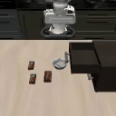 | 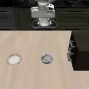 | 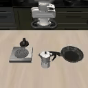 |

Примеры неуспешных кейсов:

| `put the frying pan on the stove` | `put the black bowl on the plate` | `put the wine bottle on the wine rack` |
|:---:|:---:|:---:|
| 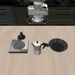 | 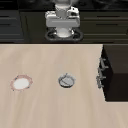 | 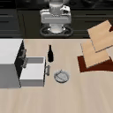 |

Как видим модель либо просто уверено делала движение которое выучила, либо немного неправильно ставила предмет в конце но не смогла его поправить и либо зависала, либо ей как будто не хватило времени на поправку (но вообще говоря ее на такое не учили).

---

## Попытки исследовать действия и результаты предобученной модели только по текстовым подсказкам

Сначала я решил, что необходимо посмотреть как вообще ведет себя модель просто на промптах, без дообучения. Я надеялся, что мы уже сможем выбить хоть какие то качество просто написав промпт. Также возможно получится запромптить как то проавильно, чтобы модель лучше выполняла здание.

### Только промпт на претрейне SmolVLA на новых задачах libero_goal

Эксперименты: [pretrain_smolvla_prompt_only_2](../experiments/2026-08-18_pretrain_smolvla_prompt_only_2/), [pretrain_smolvla_prompt_only_3](../experiments/2026-08-19_pretrain_smolvla_prompt_only_3/) (с полностью фиксированным сидом)

Разумеется я решил начать с того что уже написано в задании, просто запустить задачи из `libero_goal` с промптом и посмтреть как модель справится. Но я еще добавил несколько промптов условий:
    - true — правильная инструкция
    - wrong — инструкция другой задачи
    - nonsense — бессмысленная строка perform the dax florp twice (сгенерил клод что то)

 Справилась совсем плохо 😞, везде по нулям кроме ОДНОЙ демонстрации. 

[Вот отчетик с метриками](experiments/2026-08-18_pretrain_smolvla_prompt_only_2/reports/REPORT.md)

| Условие                  | Результат |
| ------------------------ | --------- |
| Правильная инструкция    | 1/200     |
| Неправильная инструкция  | 0/200     |
| Бессмысленная инструкция | 0/200     |

Ну неправильная инструкция равна 0 хотя бы говорит, что модель не выучила просто сцену и хоть как то отталкивается от промпта. Поскольку перед этим претрейн прошёл контроль на seen кейсах, нулевой результат нельзя было бы просто объяснить поломкой пайплайна валидации.

### А работает ли язык в знакомых сценах?

Эксперимент: [seen_scene_goal_prompts_v2](../experiments/2026-08-19_seen_scene_goal_prompts_v2/)

Предыдущий результат не отвечал на вопрос, игнорирует ли модель язык вообще. Возможно, язык работал, но новая сцена не позволяла выполнить действие. Поэтому в [seen_scene_goal_prompts_v2](../experiments/2026-08-19_seen_scene_goal_prompts_v2/) мы вернули модель в знакомые сцены libero_90 и начали менять только текст инструкции. На промптах, которые соответвуютс сцене и заданию все норм (мы это уже делали). 

Затем я поменял местами инструкции между двумя совместимыми сценами. В сцене включения плиты команда put the frying pan on the stove дала 17/20 успехов по задаче со сковородой, а в сцене со сковородой команда turn on the stove дала 20/20 успехов по включению плиты. Результаты оказались сопоставимы с выполнением этих навыков в родных сценах — 16/20 и 20/20 соответственно. Это показало, что текстовая инструкция действительно выбирает нужный обученный навык.

Следующим вопросом была устойчивость к перефразированию. Даже небольшое изменение обученной инструкции часто почти полностью разрушало навык. Среднее падение success rate составило 0.36. Простая замена глагола иногда была почти безвредной, но изменение структуры фразы приводило к сильному коллапсу:

| Исходная инструкция                                                  | Парафраз                                                        | Exact | Paraphrase |
| -------------------------------------------------------------------- | --------------------------------------------------------------- | ----- | ---------- |
| `turn on the stove`                                                  | `switch the stove on`                                           | 20/20 | 19/20      |
| `put the frying pan on the stove`                                    | `place the frying pan on the stove`                             | 17/20 | 17/20      |
| `close the top drawer of the cabinet`                                | `shut the cabinet's top drawer`                                 | 20/20 | 9/20       |
| `put the black bowl on top of the cabinet`                           | `place the black bowl atop the cabinet`                         | 19/20 | 0/20       |
| `put the black bowl on the plate`                                    | `place the black bowl onto the plate`                           | 15/20 | 8/20       |
| `put the wine bottle on the wine rack`                               | `place the wine bottle onto the wine rack`                      | 8/20  | 3/20       |
| `open the top drawer of the cabinet and put the bowl in it`          | `open the cabinet's top drawer and place the bowl inside it`    | 13/20 | 0/20       |
| `open the microwave`                                                 | `open the microwave door`                                       | 19/20 | 17/20      |
| `pick up the alphabet soup and put it in the basket`                 | `pick up the alphabet soup, then place it in the basket`        | 2/20  | 0/20       |
| `pick up the book and place it in the left compartment of the caddy` | `pick up the book and put it into the caddy's left compartment` | 12/20 | 0/20       |

- притяжательная конструкция cabinet's top drawer: падение на 0.55–0.65
- редкое слово atop: падение на 0.95
- перестановка частей инструкции: падение на 0.60
- замена put на place: падение от 0 до 0.35

Отдельно в [seen_article_drop](../experiments/2026-08-20_01-55-23_seen_article_drop/) проверялось удаление первого артикля. Для семи из десяти задач изменение почти не влияло на результат, но две задачи упали с 19/20 до 8/20. Таким образом, модель не всегда требует точного совпадения строки, однако её устойчивость сильно зависит от конкретной задачи и типа текстового изменения.

### Новые инструкции в знакомых сценах и знакомые инструкции в новой сцене

В [goal_prompts_in_seen_hosts](../experiments/2026-08-20_01-55-23_goal_prompts_in_seen_hosts/) я поместил новые инструкции libero_goal в знакомые сцены, содержащие подходящие объекты. Это позволяет проверить, может ли модель составить новый навык из знакомого визуального контекста.

| Знакомая сцена          | Новая инструкция         | Результат |
| ----------------------- | ------------------------ | --------- |
| Закрытие верхнего ящика | Открыть средний ящик     | 0/20      |
| Миска на шкафу          | Положить миску на плиту  | 0/20      |
| Бутылка на стойке       | Положить бутылку на шкаф | 0/20      |

| Открыть средний ящик | Положить миску на плиту | Положить бутылку на шкаф |
|:---:|:---:|:---:|
| 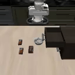 | 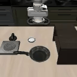 | 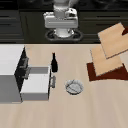 |

Ииии, все по нулям...

Ни одна новая инструкция не вызвала требуемый навык. Интересно, что в сцене с ящиком модель в 19/20 случаев вернулась к исходному навыку закрытия верхнего ящика. То есть модель просто сделала то что наиболее похоже из того что ее учили. Следовательно, модель вообще не обобщилась на новые иструкции. 

Также я сделал обратную проверку в [seen_prompts_in_goal_scene](../experiments/2026-08-20_01-55-23_seen_prompts_in_goal_scene/), а именно точные обученные строки подавались модели в новой сцене libero_goal. И тут результат оказался не полностью нулевым. 

| Инструкция                                 | Результат |
| ------------------------------------------ | --------- |
| `open the top drawer of the cabinet`       | 10/20     |
| `put the black bowl on top of the cabinet` | 7/20      |
| `open the middle drawer of the cabinet`    | 0/20      |
| Остальные инструкции                       | 0/20      |

| `open the top drawer` — success | `put the black bowl on top` — success | `open the middle drawer` — failure |
|:---:|:---:|:---:|
| 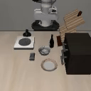 |  |  |

Но это произошло, потому что в обучении были промпты только про верхний и нижний ящик, про средний ничего не было. Видно что в среде он пытается повторить на что больше похожа сцена и делает действия на которое он был обучен, без понимания промпта.

Эти экспы показали что новая сцена не является абсолютным блокером. Некоторые простые навыки переносятся, но перенос зависит от конкретного действия, начального состояния и визуальной геометрии сцены.

В итоге, в целом, я описал бы что промпт работает как ключ, и если есть какие то расхождения с исходным промптом, то модель ломается. Возможно, у меня есть гипотеза просто увеличить понимание языка и визуального понимания, потому что наша моделька очень маленькая. Но этот эксперимент слишком большой тяжелый и выскоий риск что ничего не даст.

---

## Часть вторая, переходим к наивному бейзлайну. Сколько примеров нужно для адаптации?

*Эксперименты: [наивный бейзлайн для $k=5,10,25$](../experiments/2026-08-21_20-37-56_pretrain_smolvla_naive_deterministic_repro/), [low-k бейзлайн для $k=1,2,3$](../experiments/2026-08-18_pretrain_smolvla_few_shot_tune_low_k/) и [объединённая cost curve](../experiments/2026-08-18_analyst_curve_baseline/).*, [$k=1,2,3$](../experiments/2026-08-21_20-37-56_pretrain_smolvla_low_k_deterministic_repro/)

После экспериментов где мы юзали только промпты стало понятно, что при $k=0$ один текст почти ничего не дает. Поэтому следующим шагом я запустил наивный бейзлайн из задания и сначала посмотрел на бюджеты которые предлагались нам в задании $k=5,10,25$.

Для каждой пары задача-бюджет я независимо начинал с одного и того же претрейна. Брались первые $k$ официальных демонстраций задачи — `demo_0..demo_{k-1}`. Модель обучалась 2000 шагов толкько action expert, а vision encoder и VLM оставались замороженными. Для каждой точки выполнялось 20 оценочных роллаутов.

### Сначала я сделал эксп вообще бля базовой SmolVLA

До основной кривой я сделал отдельную [абляцию без LIBERO-претрейна](../experiments/2026-08-19_base_smolvla_cost_curve/). В ней использовался тот же протокол, но каждая адаптация начиналась с `lerobot/smolvla_base`, а не с нашего checkpoint после LIBERO-90. Это не полностью случайно инициализированная модель: базовая SmolVLA была обучена на реальном SO-100, однако LIBERO  она раньше не видела. На всех десяти задачах её средний success составил 0.485 при $k=1$, 0.745 при $k=5$ и 0.790 при $k=25$ против 0.550, 0.830 и 0.850 у модели с LIBERO-претрейном. При $k=10$ разрыв почти исчез: 0.865 против 0.875.

| $k$ | Без LIBERO-претрейна, все 10 задач | После LIBERO-90, все 10 задач |
|---:|---:|---:|
| 1 | $0.485\ [0.417;\ 0.554]$ | $0.550\ [0.481;\ 0.617]$ |
| 5 | $0.745\ [0.680;\ 0.800]$ | $0.830\ [0.772;\ 0.876]$ |
| 10 | $0.865\ [0.811;\ 0.906]$ | $0.875\ [0.822;\ 0.914]$ |
| 25 | $0.790\ [0.728;\ 0.841]$ | $0.850\ [0.794;\ 0.893]$ |

В скобках выше указаны 95%-е интервалы Уилсона по 200 роллаутам каждой точки полного десятизадачного среза. Точечные оценки везде согласуются с пользой in domain претрейна, особенно при малых бюджетах, но интервалы заметно перекрываются, поэтому по ним одним нельзя утверждать статистически надёжный разрыв для отдельного $k$.

### Сначала для $k=5,10,25$ результата отличный

Результат оказался неожиданно хорошим: уже пяти демонстраций хватило, чтобы почти насытить кривую. Увеличение бюджета до 10 и 25 демонстраций не давало устойчивого дальнейшего роста.

| Срез задач                 | $k=5$ | $k=10$ | $k=25$ |
| -------------------------- | ----- | ------ | ------ |
| Все 10 задач `libero_goal` | 0.830 | 0.875  | 0.850  |
| Основные задачи 0–2        | 0.950 | 0.950  | 0.900  |

Примеры успешных роллаутов задачи `open the middle drawer of the cabinet`:

| $k=5$ | $k=10$ | $k=25$ |
|:-----:|:------:|:------:|
|  | 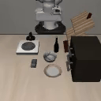 |  |

Кривая при $k=5/10/25$ получилась почти плоской и на всех десяти задачах максимум был при $k=10$, а на основных задачах 0–2 качество уже при $k=5$ достигло 0.95. Поэтому после этого я перешел к более интересному режиму и запустил тот же протокол при $k=1,2,3$.

### Переход к малым бюджетам $k=1,2,3$

| Срез задач                 | $k=1$ | $k=2$ | $k=3$ |
| -------------------------- | ----- | ----- | ----- |
| Все 10 задач `libero_goal` | 0.550 | 0.705 | 0.780 |
| Основные задачи 0–2        | 0.567 | 0.717 | 0.717 |

Даже одна демонстрация уже дала 0.55. Вторая демонстрация дала еще большой прирост до 0.705, а третья — до 0.78. То есть основная часть адаптации происходила между $k=0$ и $k=3$, а не между $k=5$ и $k=25$.

Примеры успешных роллаутов той же задачи при малом числе демонстраций:

| $k=1$ | $k=2$ | $k=3$ |
|:-----:|:-----:|:-----:|
| 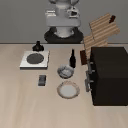 | 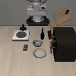 |  |

### Полная cost curve

После объединения prompt-only точки и двух серий адаптаций получилась полная кривая для бюджетов $k=0,1,2,3,5,10,25$:

| Срез задач          | $k=0$ | $k=1$ | $k=2$ | $k=3$ | $k=5$ | $k=10$ | $k=25$ |
| ------------------- | ----- | ----- | ----- | ----- | ----- | ------ | ------ |
| Все 10 задач        | 0.005 | 0.550 | 0.705 | 0.780 | 0.830 | 0.875  | 0.850  |
| Основные задачи 0–2 | 0.000 | 0.567 | 0.717 | 0.717 | 0.950 | 0.950  | 0.900  |

Кривые отдельных задач сильно различались:

| ID  | Задача                                      | $k=0$ | $k=1$ | $k=2$ | $k=3$ | $k=5$ | $k=10$ | $k=25$ |
| --- | ------------------------------------------- | ----- | ----- | ----- | ----- | ----- | ------ | ------ |
| 0   | `open the middle drawer of the cabinet`     | 0.00  | 0.15  | 0.35  | 0.45  | 0.90  | 0.95   | 1.00   |
| 1   | `put the bowl on the stove`                 | 0.00  | 0.80  | 0.90  | 0.95  | 1.00  | 1.00   | 0.90   |
| 2   | `put the wine bottle on top of the cabinet` | 0.00  | 0.75  | 0.90  | 0.75  | 0.95  | 0.90   | 0.80   |

Главный вывод этого бейзлайна, что SmolVLA адаптируется очень быстро: наибольший прирост дает уже первая демонстрация, а к пяти демонстрациям большинство задач близко к насыщению. При этом кривая не обязана быть монотонной, даже при фиксированных 2000 шагах и 20 rollout-эпизодах некоторые точки при большем $k$ оказывались хуже. Поэтому отдельные небольшие падения нельзя интерпретировать как доказательство вреда дополнительных данных.

Нормализованная площадь под кривой составила 0.818 по всем десяти задачам и 0.877 по задачам 0–2. Вариант nAUC по шкале $\log_2(1+k)$, который сильнее учитывает дешевые точки $k=1..3$, составил 0.689 и 0.728 соответственно.

### Есть две важные оговорки.

Во-первых, это single-seed кривая, поэтому она является бейзлайном, а не окончательной оценкой дисперсии обучения.

Во-вторых, в исходных запусках фиксировались seed среды и начальное состояние, но flow-sampling noise политики шел из общего process-global RNG. Позже я повторил задачи 0–2 с batch size 1 и отдельным seed `1000 + episode_index` одновременно для среды и flow-sampling. Эта детерминированная перепроверка сохранила главный вывод: резкий рост происходит на малых $k$, а после $k=5$ кривая почти насыщается.

| ID  | Задача                                      | $k=1$     | $k=2$     | $k=3$     | $k=5$     | $k=10$    | $k=25$    |
| --- | ------------------------------------------- | --------- | --------- | --------- | --------- | --------- | --------- |
| 0   | `open the middle drawer of the cabinet`     | 0.15      | 0.30      | 0.35      | 0.90      | 0.90      | 0.95      |
| 1   | `put the bowl on the stove`                 | 0.85      | 0.85      | 0.85      | 0.95      | 1.00      | 1.00      |
| 2   | `put the wine bottle on top of the cabinet` | 0.80      | 0.90      | 0.80      | 0.80      | 0.95      | 0.80      |
|     | **Среднее по задачам 0–2**                  | **0.600** | **0.683** | **0.667** | **0.883** | **0.950** | **0.917** |

---

## Переходим к улучшениям

*Эксперименты: [частота препланирования](../experiments/2026-08-20_20-03-21_pretrain_smolvla_low_k_action_steps/)* `n_action_steps`*, [полный finetune](../experiments/2026-08-22_18-10-40_pretrain_smolvla_full_ft_low_k/),  [state-noise](../experiments/2026-08-22_22-43-55_pretrain_smolvla_state_noise_k1/), [image-аугментации](../experiments/2026-08-23_00-18-49_pretrain_smolvla_image_aug_low_k/), [state-noise при 1000 шагах](../experiments/2026-08-23_14-31-07_pretrain_smolvla_state_noise_k1_1k_steps/) и [итоговый bundle](../experiments/2026-08-23_18-20-07_pretrain_smolvla_bundle_all_k/).*

Наивный бейзлайн уже был сильным при $k\ge5$, поэтому основной резерв для улучшения находился в левой части кривой — при $k=1,2,3$. Я решил двигаться от самых дешевых изменений к бовлее сложным: сначала не переобучать модель вообще и изменить только способ исполнения действий, затем разморозить всю модель, добавить регуляризацию изображений и состояния и в конце объединить лучшие идеи в один рецепт.

Все улучшения проверялись на основных задачах 0–2. Для каждой точки использовались первые официальные `demo_0..demo_{k-1}`, один training seed 1000 и 20 оценочных эпизодов с закрепленными начальными состояниями и отдельным flow sampling seed для каждого эпизода.

### Начал с простого и изменил только частоту перепланирования действий

Параметр `n_action_steps` определяет, сколько предсказанных действий робот выполняет до следующего обращения к модели. Маленькое значение чаще перепланирует траекторию, но может сделать движение дерганым, большое значение дольше следует одному action chunk и хуже исправляет накопившуюся ошибку. В [первом эксперименте](../experiments/2026-08-20_20-03-21_pretrain_smolvla_low_k_action_steps/) я взял уже обученные expert-only чекпойнты и оценил каждый из них при `n_action_steps=1,10,25` на одном и том же банке эпизодов.

| Бюджет | $n=1$ | $n=10$    | $n=25$    |
| ------ | ----- | --------- | --------- |
| $k=1$  | 0.333 | 0.567     | 0.567     |
| $k=2$  | 0.467 | **0.800** | 0.767     |
| $k=3$  | 0.650 | 0.717     | **0.733** |

Слишком частое перепланирование при $n=1$ оказалось хуже. Значения 10 и 25 чаще выигрывали, но единственного лучшего `n_action_steps` для всех задач и бюджетов не нашлось. Поэтому дальше я не стал считать этот параметр самостоятельным решением и начал оценивать новые модели при нескольких значениях $n$.

### Разморозил всю модель

В наивном бейзлайне обучался только action expert. Следующей гипотезой было то, что для новой сцены недостаточно поменять только выходную часть: модели также нужно адаптировать визуальные признаки и их связь с текстом. Поэтому в [full finetune эксперименте](../experiments/2026-08-22_18-10-40_pretrain_smolvla_full_ft_low_k/) я разморозил vision encoder, VLM, connector, action expert и проекции.

| Средний success по задачам 0–2                 | $k=1$ | $k=2$     | $k=3$     |
| ---------------------------------------------- | ----- | --------- | --------- |
| Детерминированный expert-only бейзлайн, $n=50$ | 0.600 | 0.683     | 0.667     |
| Full finetune, $n=50$                         | 0.583 | **0.950** | **0.767** |
| Full finetune, $n=25$                         | 0.533 | 0.750     | **0.800** |

Полный файнтюнинг резко улучшил $k=2$ и заметно улучшил $k=3$, но не помог при одной демонстрации. Это стало важным результатом: дополнительная пластичность модели полезна, однако при $k=1$ она одновременно повышает риск переобучения на единственную траекторию. Для $k=2$ я модель почти выбила 1.0, поэтому на следующих экспериментах я решил сосредоточиться на $k=1$ и $k=2$

На неуспешных роллаутах при $k=1$ это хорошо видно: робот подводит руку к нужному ящику и почти начинает требуемое действие, но затем колеблется около цели и не завершает открытие. Ни более длинный action chunk при $n=50$, ни более частое перепланирование при $n=25$ не исправили это поведение.

| Неудачный роллаут, $k=1$, $n=50$ | Неудачный роллаут, $k=1$, $n=25$ |
|:---:|:---:|
|  |  |

### Первая попытка регуляризации: шум состояния

Из предыдущих гифок я подумал что модели нехватает более сильной уверености в действиях. Чтобы единственная демонстрация не запоминалась как одна точная последовательность состояний, я начал добавлять гауссовский шум к нормализованной проприоцепции только во время обучения. В [первом эксперименте](../experiments/2026-08-22_22-43-55_pretrain_smolvla_state_noise_k1/) все модели обучались 2000 шагов, а ветка $\alpha=0$ была внутренним контролем, просто проверить что агент ничего не сломал.

Подробнее о шуме, сначала каждая компонента состояния нормализовалась по статистикам датасета:

$$
\hat{s}_{t,i}=\frac{s_{t,i}-\mu_i}{\sigma_i}.
$$

Затем во время каждого обучающего шага к нормализованному состоянию добавлялся независимый гауссовский шум:

$$
\tilde{s}_t=\hat{s}_t+\alpha\varepsilon_t, \qquad \varepsilon_t\sim\mathcal{N}(0,I).
$$

Параметр $\alpha$ задавал силу шума в нормализованном пространстве. В исходных единицах это соответствует стандартному отклонению шума $\alpha\sigma_i$ для каждой компоненты состояния. Изображения и действия не изменялись, а во время оценки шум полностью отключался.

Идея основана на классической регуляризации посредством шума входных данных и близка к методам компенсации proprioception shift, в частности к работе [Adapt Your Body: Mitigating Proprioception Shifts in Imitation Learning, 2025](https://arxiv.org/abs/2506.23944). Однако здесь использовалась упрощённая собственная реализация с фиксированным $\alpha$, выбранным экспериментально.

| State-noise при $k=1$ | $\alpha=0$ | $\alpha=0.01$ | $\alpha=0.03$ | $\alpha=0.05$ |
| --------------------- | ---------- | ------------- | ------------- | ------------- |
| Средний success       | 0.617      | 0.583         | 0.667         | **0.683**     |

Совсем маленький шум не помог, но при $\alpha=0.03$ и $0.05$ качество выросло. Значит, идея регуляризации состояния работала, но лучший результат находился на границе проверенного диапазона и стоило попробовать более сильный шум.

### БОЛЬШЕ шума

В [следующем эксперименте](../experiments/2026-08-23_14-31-07_pretrain_smolvla_state_noise_k1_1k_steps/) обучение было сокращено до 1000 шагов (там по лоссу было видно что так много не надо), а диапазон state-noise расширен до $\alpha=0.08,0.10,0.20$.

| State-noise при $k=1$, 1000 шагов | $\alpha=0$ | $\alpha=0.08$ | $\alpha=0.10$ | $\alpha=0.20$ |
| --------------------------------- | ---------- | ------------- | ------------- | ------------- |
| Средний success                   | 0.600      | 0.667         | **0.700**     | 0.667         |

Лучшей точкой стал $\alpha=0.10$, а средний success rate вырос с 0.600 до 0.700 относительно контроля с теми же 1000 шагами. При $\alpha=0.20$ качество снова снизилось, поэтому для итогового рецепта я выбрал шум 0.10 и короткое обучение при $k=1$.

### Добавил аугментации изображений

Параллельно я проверил визуальную регуляризацию. В [эксперименте с image аугментациями](../experiments/2026-08-23_00-18-49_pretrain_smolvla_image_aug_low_k/) во время full finetune применялись стандартные трансформации LeRobot, все стандартно, изменения яркости, контраста, насыщенности, оттенка и резкости, а также небольшой affine-поворот и сдвиг. На оценке изображения оставались исходными.

| Рецепт                          | $k=1$     | $k=2$     | $k=3$     |
| ------------------------------- | --------- | --------- | --------- |
| Full-FT без аугментаций, $n_action_steps=50$ | **0.583**     | **0.950**     | 0.767     |
| Full-FT + image aug, $n_action_steps=50$     | 0.583     | 0.900     | 0.783     |
| Full-FT без аугментаций, $n_action_steps=25$ | 0.533     | 0.750     | 0.800     |
| Full-FT + image aug, $n_action_steps=25$     | 0.567 | 0.783 | **0.817** |

Для $k=1$ результат по отдельным задачам выглядел так:

| ID | Задача | Без aug, $n_action_steps=50$ | Image aug, $n_action_steps=50$ | Без aug, $n_action_steps=25$ | Image aug, $n_action_steps=25$ |
|---:|---|---:|---:|---:|---:|
| 0 | `open the middle drawer of the cabinet` | 0.10 | **0.15** | 0.00 | 0.00 |
| 1 | `put the bowl on the stove` | 0.95 | 0.95 | 0.95 | **1.00** |
| 2 | `put the wine bottle on top of the cabinet` | **0.70** | 0.65 | 0.65 | **0.70** |
|  | **Среднее** | **0.583** | **0.583** | **0.533** | **0.567** |

Тут видно как руинит первая задача, но! С агументацией мы получаем улучшение но в это шум скорее всего.

Эффект получился смешанным. При $n_action_steps=50$ аугментации немного улучшили $k=3$, но ухудшили $k=2$, при $n_action_steps=25$ они дали небольшой прирост во всех трех точках. Поэтому image-аугментации я сохранил как вспомогательную регуляризацию, а не как отдельный главный источник улучшения.

### Итоговый bundle на всей кривой

После отдельных проверок я собрал [единый bundle-эксперимент](../experiments/2026-08-23_18-20-07_pretrain_smolvla_bundle_all_k/): full finetune, image-аугментации, state-noise $\alpha=0.10$ и число шагов обучения, зависящее от количества данных. При $k=1$ модель обучалась 1000 шагов, при $k=2$ — 1500, а при $k\ge3$ — 2000. Для каждого чекпойнта отдельно измерялись `n_action_steps=50,35,25` эти варианты не смешивались внутри одной кривой.

| Средний success по задачам 0–2                 | $k=0$ | $k=1$     | $k=2$     | $k=3$     | $k=5$     | $k=10$    | $k=25$    |
| ---------------------------------------------- | ----- | --------- | --------- | --------- | --------- | --------- | --------- |
| Детерминированный expert-only бейзлайн, $n_action_steps=50$ | 0.000 | 0.600     | 0.683     | 0.667     | 0.883     | **0.950** | 0.917 |
| Bundle, $n_action_steps=50$                                 | 0.000 | **0.700** | **0.883** | 0.833 | 0.883     | 0.917     | 0.867     |
| Bundle, $n_action_steps=35$                                 | 0.000 | 0.667     | 0.750     | 0.833     | 0.833     | 0.867     | 0.933     |
| Bundle, $n_action_steps=25$                                 | 0.000 | 0.633     | 0.800     | **0.900** | **0.900** | 0.933     | **0.967** |

Каждая точка здесь объединяет 60 роллаутов — по 20 для каждой из трех задач. Для `n_action_steps=50` 95% доверительные интервалы Уилсона составили при $k=1$ — $[0.474; 0.714]$ для бейзлайна и $[0.575; 0.801]$ для bundle, при $k=2$ — $[0.558; 0.787]$ и $[0.778; 0.942]$, при $k=3$ — $[0.541; 0.773]$ и $[0.720; 0.907]$ соответственно. Интервалы остаются достаточно широкими, поэтому одних точечных оценок недостаточно для уверенного вывода.

Поскольку обе модели оценивались на одних и тех же начальных состояниях и seed, дополнительно можно использовать парное сравнение Мак-Немара. Для $k=1$ оно дает $p=0.070$: наблюдается положительный тренд, но условынй порог 0.05 не достигнут. Для $k=2$ и $k=3$ различия убедительнее — $p=0.0075$ и $p=0.021$ соответственно. При $k=5$ результаты совпали, а небольшие снижения при $k=10$ и $k=25$ статистически неотличимы от случайной вариативности ($p=0.727$ и $p=0.508$). Поэтому наиболее надежный результат bundle улучшение точек $k=2$ и $k=3$, а улучшение $k=1$ пока следует считать многообещающим, но предварительным.

Эти интервалы и тесты учитывают только вариативность 60 оценочных роллаутов для фиксированных чекпойнтов. Они не отражают разброс между обучениями, поскольку все модели по-прежнему были получены с одним training seed (я знаю что надо было с 2, но я не успел).

Для основной bundle-кривой при $n_action_steps=50$ результаты по отдельным задачам выглядели так:

| ID  | Задача                                      | $k=1$     | $k=2$     | $k=3$     | $k=5$     | $k=10$    | $k=25$    |
| --- | ------------------------------------------- | --------- | --------- | --------- | --------- | --------- | --------- |
| 0   | `open the middle drawer of the cabinet`     | 0.35      | 0.80      | 0.65      | 0.90      | 0.85      | 0.75      |
| 1   | `put the bowl on the stove`                 | 0.90      | 1.00      | 0.95      | 0.95      | 0.95      | 0.95      |
| 2   | `put the wine bottle on top of the cabinet` | 0.85      | 0.85      | 0.90      | 0.80      | 0.95      | 0.90      |
|     | **Среднее**                                 | **0.700** | **0.883** | **0.833** | **0.883** | **0.917** | **0.867** |

Ниже итоговая bundle-кривая при `n_action_steps=50` наложена на исходный детерминированный expert-only бейзлайн с тем же режимом инференса. Точки показывают среднее по задачам 0–2, а полупрозрачные области и error bars — 95%-е доверительные интервалы Уилсона по 60 роллаутам для каждого $k$.

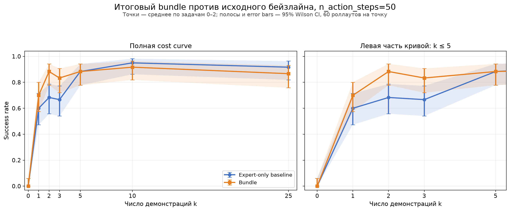

В итоге улучшение не свелось к одному удачному трюку. Full finetune дал основной прирост при $k=2,3$, state-noise и уменьшение числа шагов помогли при $k=1$, image-аугментации дали небольшую дополнительную регуляризацию, а свип `n_action_steps` показал, насколько сильно итог зависит от частоты перепланирования. Главный результат — удалось поднять левую, самую важную часть cost curve, но универсального рецепта, который был бы лучше бейзлайна при каждом $k$, получить не удалось. Все эти значения по-прежнему относятся к одному training seed, поэтому они показывают направление улучшения, а не окончательную оценку дисперсии.

---

## БОНУС

В бонусной части я решил проверить, можно ли автоматически ранжировать чекпойнты политики по видео (B), не запуская дополнительное обучение самой SmolVLA. Сначала в [эксперименте с собственным progress-critic](../experiments/2026-08-23_20-49-13_bonus_qwen35_progress_critic/) я дообучил Qwen3.5-4B с LoRA на экспертных траекториях LIBERO-90. На вход подавались также как в Robometer инструкция и четыре последовательных кадра из префикса роллаута, а модель предсказывала достигнутый прогресс, разбитый на 32 бина. Для экспертной траектории длины $T$ прогресс последнего кадра префикса с индексом $t$ определялся как $p=t/(T-1)$, после чего переводился в класс $b=\operatorname{round}(31p)$: бин 0 соответствовал началу, а бин 31 — концу демонстрации. Чтобы равномерно покрыть всю траекторию, во время обучения сначала случайно выбирался бин, затем соответствующий endpoint, а четыре входных кадра равномерно брались между началом и этим endpoint. Таким образом, target обозначал временное продвижение по успешной экспертной демонстрации, а не вероятность success и не reward среды.

Важно, что сравнение было не полностью симметричным. Использованный `Robometer-4B-LIBERO` обучался не только предсказывать progress, но и решать preference задачу на парах успешных и неуспешных траекторий, более и менее продвинутых префиксов, rewound-видео и видео с неправильной инструкцией. Кроме того, Robometer видел LIBERO-Goal, включая наши целевые задачи, тогда как мой критик обучался только на успешных экспертных демонстрациях LIBERO-90 и только на progress таргете. У нашей версии Robometer при этом не была обучена success head, поэтому для честного сравнения от неё использовался тот же progress, а не вероятность успеха.

Затем в [эксперименте сравнения с Robometer](../experiments/2026-08-23_23-03-30_bonus_critic_vs_robometer_ranking/) оба критика вслепую оценили одни и те же 420 сохранённых роллаутов. Три задачи, семь кандидатов на задачу и по 20 эпизодов каждого кандидата. Метки success были присоединены только после получения всех предсказаний, а качество измерялось корреляцией между оценкой критика и реальным success rate чекпойнта.

| Критик | Macro Spearman $\rho$ | 95% bootstrap CI | Выбор лучшего набора | Средний regret |
|---|---:|---:|---:|---:|
| Собственный Qwen3.5 critic | 0.294 | $[0.072;\ 0.602]$ | 1/3 | 0.200 |
| Robometer-4B-LIBERO | 0.300 | $[0.129;\ 0.590]$ | **2/3** | **0.333** |

По точечной оценке Robometer оказался впереди всего на 0.006. При этом 95% интервал разности собственный critic минус Robometer равен $[-0.379;\ 0.328]$, поэтому статистически подтверждённого победителя нет. Результат сильно зависел от задачи: Robometer хорошо ранжировал drawer и wine bottle, но на bowl выбрал претрейн с success rate 0, тогда как собственный critic лучше работал именно на bowl. Поэтому бонус показал, что видеокритик действительно извлекает полезный сигнал прогресса, но трёх задач пока недостаточно, чтобы считать его надёжным универсальным селектором политики.

---

## Разбор ошибок

После $k\ge1$ модель обычно выбирала правильный объект и двигалась в нужную сторону. Основные остаточные ошибки возникали уже не на уровне языка, а во время контакта с объектом: на границе action chunks, при проверке захвата и при отклонении от единственной обучающей траектории.

### Drawer перепланирование разрушает контакт

В [неуспешном роллауте с `n_action_steps=25`](media/error_drawer_k2_n25_failure_ep1.gif) робот находил ручку среднего ящика и потрогал ее, но после перепланирования начинал делать мелкие несовместимые коррекции вместо цельного движения на себя. На том же checkpoint, начальном состоянии и seed [режим `n_action_steps=50` успешно открывал ящик](media/error_drawer_k2_n50_success_ep1.gif). В целом для `task=0, k=2` сокращение chunk снизило результат с 20/20 до 8/20, причём все несовпадения имели направление `success -> failure`.

Вероятная причина потеря временной согласованности: новый chunk начинается уже во время контакта и прерывает тяговое движение. Это можно проверить, выполнив первые 25 действий, а затем сравнив обычное перепланирование с продолжением сохранённой второй половины исходного 50-шагового chunk.

### Bowl таска с фантомный захватом

В [неуспешном роллауте `task=1, k=1`](media/error_bowl_k1_n50_failure_ep18.gif) gripper закрывался рядом с bowl, однако предмет оставался на столе. Несмотря на это, рука переходила к переносу и двигалась к stove так, будто захват уже состоялся. При более частом перепланировании [тот же эпизод с `n_action_steps=10` завершался успешно](media/error_bowl_k1_n10_success_ep18.gif).

Переход `grasp -> transport` определялся положением внутри выученной траектории, а не фактом подъёма предмета, поэтому после промаха модель не делала повторную попытку. Однако суммарно оба режима дали одинаковые 17/20, поэтому этот пример показывает механизм ошибки, но не доказывает преимущество короткого chunk. Гипотезу можно проверить принудительным перепланированием сразу после закрытия gripper и логированием высоты bowl.

### Wine bottle переобучение на одну траекторию

Без state noise в [episode 12](media/error_bottle_k1_alpha000_failure_ep12.gif) gripper проходил рядом с бутылкой и продолжал движение к cabinet без предмета. На том же начальном состоянии и seed модель, обученная с небольшим шумом $\alpha=0.03$, [захватывала бутылку и завершала перенос](media/error_bottle_k1_alpha003_success_ep12.gif). По всей точке `task=2, k=1` success вырос с 15/20 до 19/20: исправились четыре эпизода, не потерялся ни один. Image-аугментации при этом дали только 13/20.

Это согласуется с гипотезой о переобучении на узкую зависимость `proprioceptive state -> action`: небольшое отличие стартовой позы сдвигает gripper в момент захвата, а state noise сглаживает эту зависимость. Но результат получен на одном seed, поэтому его следует считать наблюдением, а не доказанным эффектом. Для проверки нужны несколько seed и раздельное варьирование позы робота, положения бутылки и параметров камеры.

Таким образом, самые характерные провалы связаны с тремя разными bottleneck: согласованностью соседних action chunks, отсутствием проверки успешного захвата и чувствительностью к геометрии единственной демонстрации. Это также объясняет, почему изменение `n_action_steps` особенно сильно влияло на drawer, а proprioception noise — на захват wine bottle.

---

## Кладбище идей 💀

Оновные варианты, от которых я отказался или которые сознательно не включил в итоговую кривую (или не хватило времени и смелости):

- **Заново претрейнить языковую часть.** это могло бы уменьшить хрупкость к формулировкам, но такой эксперимент намного дороже всех остальных и одновременно меняет слишком много факторов. По текущим результатам не было гарантии, что большая модель исправит именно перенос в новую визуальную сцену, поэтому риск потратить весь вычислительный бюджет без понятного вывода был слишком высоким плюс надо брать откуда то много данных

- **Использовать LoRA вместо full finetune (как в статье OpenVLA)** SmolVLA достаточно маленькая и полный файнтюн помещался на доступных GPU, а сам full finetune уже дал сильный прирост при $k=2,3$. Для LoRA пришлось бы отдельно подбирать бы rank, target модули и learning rate, поэтому при ограниченном времени этот свип выглядел менее полезным, чем проверка регуляризации уже работающего full finetune.

- **Массово размножить инструкции парафразами.** Эксперименты с текстом показали, что отдельные синонимы и небольшие перестройки фразы могут как почти не влиять, так и полностью ломать навык. Чтобы такая аугментация была честной, потребовалось бы покрыть много синтаксических шаблонов, а не просто заменить несколько слов. Кроме того, при $k=0$ главным ограничением оказалась новая сцена, поэтому одна только текстовая аугментация вряд ли исправила бы основной bottleneck. Ну и тут четно говря времени не хватило, впринцпе негенрить можно было много праафраз

- **Собирать корректирующие траектории в стиле DAgger или DART.** Это хорошо подходило бы для случаев, где рука подходит к объекту, но не завершает действие или что то делает но делает неправильно и потом просто ломается и заедает. Однако по условиям среду можно использовать для оценки, а не для сбора новых обучающих демонстраций.

- **Выбирать “лучшие” демонстрации с помощью критика или Robometer.** Иде хорошая, не хватило времени 😭

- **Сглаживать переходы между action chunks, а не только уменьшать `n_action_steps`.** В работе [ACT](https://arxiv.org/abs/2304.13705) для этого использовали temporal ensembling: политику вызывали чаще, получали перекрывающиеся предсказания и при выполнении усредняли несколько вариантов действия для одного момента времени, сильнее учитывая более свежий чанк. Так граница между последовательностями становилась менее резкой. Для flow-matching VLA существует еще более близкий метод [SEAM](https://arxiv.org/abs/2607.04609), который при генерации нового chunk использует невыполненный хвост предыдущего как ориентир согласованности. Такая штука меняет алгоритм инференса, требует отдельной реализации выравнивания и хранения перекрывающихся chunks, это сложно.
